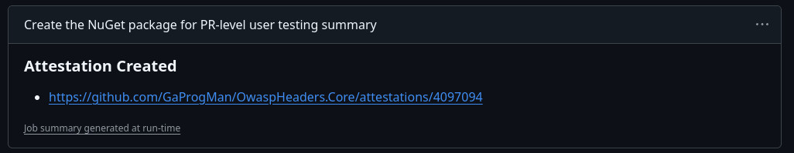
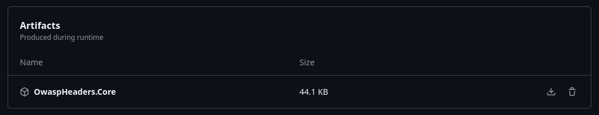
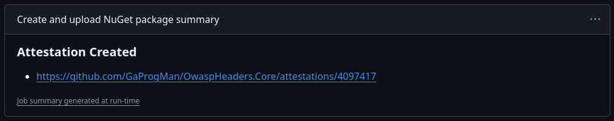

As of [PR 148](https://github.com/GaProgMan/OwaspHeaders.Core/pull/148), OwaspHeaders.Core uses the GitHub provided process for creating attestations per build. This document talks through how to verify those attestations using the [gh CLI](https://cli.github.com/).

The information presented on this page is split between PR Builds and NuGet Releases. Each section attempts to explain the difference between the two builds.

## PR Build

All PRs are built using the [dotnet.yml](https://github.com/GaProgMan/OwaspHeaders.Core/blob/main/.github/workflows/dotnet.yml) file found in the .github/Workflows directory in the GitHub repo. Attestations for these builds are created in the step labelled "Generate Attestations":

```yaml
# The following yml is correct as of Dec 23rd, 2024
# For the latest version, please see:
# https://github.com/GaProgMan/OwaspHeaders.Core/blob/main/.github/workflows/dotnet.yml
- name: Generate Attestations
    uses: actions/attest-build-provenance@963f8a02f24ac90336362e63ca6730cf69ad102e # v2.1.0
    with:
    subject-path: ${{ github.workspace }}/**/*.nupkg
```

This step will provide an attestation for the commit which caused the PR build to run.

### Slightly Less Manual Verification

When the build workflow completes, there will be a section in the job summary called "Create the NuGet package for PR-level user testing summary" (see: [this link](https://github.com/GaProgMan/OwaspHeaders.Core/actions/runs/12473647282#summary-34814538093) or the following screenshot for an example)



Clicking the link under "Attestation created" will take you to the attestation for the particular build of OwaspHeaders.Core.

In the above screenshot, the Attestation link is [https://github.com/GaProgMan/OwaspHeaders.Core/attestations/4097094](https://github.com/GaProgMan/OwaspHeaders.Core/attestations/4097094).

### Manual Verification

In order to manually verify the nupkg file, you will need to download the generated artifact for a given workflow run and follow the steps below.

- Open a workflow run
  - For example: https://github.com/GaProgMan/OwaspHeaders.Core/actions/runs/12473647282
- Scroll to the bottom of the workflow run and download the generated artifact
  - The file will be called "OwaspHeaders.Core"
  - See the following screenshot:



- Extract the zip file
  - You can using your favourite unarchiver
  - Or you can open the zip file and drag the nupkg file out
- Open a terminal where you have extracted the nupkg file
- Run `gh attestation verify --owner GaProgMan OwaspHeaders.Core.x.y.z.nupkg`
  - Replacing `x.y.z` with the version number of the nupkg file

You should receive output which matches the following:

```bash
Loaded digest sha256:5e657fed02f84c8072a33a8791e01d6bd45c67863f83ec8542154af08171ed04 for file://OwaspHeaders.Core.9.4.3.nupkg
Loaded 1 attestation from GitHub API

The following policy criteria will be enforced:
- OIDC Issuer must match:................... https://token.actions.githubusercontent.com
- Source Repository Owner URI must match:... https://github.com/GaProgMan
- Predicate type must match:................ https://slsa.dev/provenance/v1
- Subject Alternative Name must match regex: (?i)^https://github.com/GaProgMan/

✓ Verification succeeded!

sha256:5e657fed02f84c8072a33a8791e01d6bd45c67863f83ec8542154af08171ed04 was attested by:
REPO                         PREDICATE_TYPE                  WORKFLOW                                        
GaProgMan/OwaspHeaders.Core  https://slsa.dev/provenance/v1  .github/workflows/dotnet.yml@refs/pull/148/merge
```

> [!NOTE] NOTE
> The above output is specific to the version of OwaspHeaders.Core built using the first workflow run for [PR 148](https://github.com/GaProgMan/OwaspHeaders.Core/pull/148). The output you receive will differ slightly.

## NuGet Releases

All NuGet releases are built using the [release.yml](https://github.com/GaProgMan/OwaspHeaders.Core/blob/main/.github/workflows/release.yml) file found in the .github/Workflows directory in the GitHub repo. Attestations for these builds are created in the step labelled "Generate Attestations":

```yaml
# The following yml is correct as of Dec 23rd, 2024
# For the latest version, please see:
# https://github.com/GaProgMan/OwaspHeaders.Core/blob/main/.github/release/dotnet.yml
- name: Generate Attestations
    uses: actions/attest-build-provenance@963f8a02f24ac90336362e63ca6730cf69ad102e # v2.1.0
    with:
    subject-path: ${{ github.workspace }}/**/*.nupkg
```

This step will provide an attestation for the commit which caused the NuGet release to be created

### Slightly Less Manual Verification

When the build workflow completes, there will be a section in the job summary called "Create the NuGet package for PR-level user testing summary" (see: [this link](https://github.com/GaProgMan/OwaspHeaders.Core/actions/runs/12474053355) or the following screenshot for an example)



Clicking the link under "Attestation created" will take you to the attestation for the particular build of OwaspHeaders.Core.

In the above screenshot, the Attestation link is [https://github.com/GaProgMan/OwaspHeaders.Core/attestations/4097417](https://github.com/GaProgMan/OwaspHeaders.Core/attestations/4097417).

### Manual Verification

TBC

## Resources

- [Artifact Attestations is generally available](https://github.blog/changelog/2024-06-25-artifact-attestations-is-generally-available/)
- [gh CLI](https://cli.github.com/)