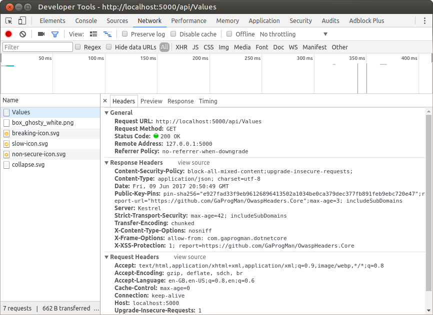

A .NET Core middleware for injecting the Owasp recommended HTTP Headers for increased security.

## Licence Used
[](https://opensource.org/licenses/MIT)

See the contents of the LICENSE file for details

# Description
A collection of ASP.NET Core middleware classes designed to increase web application security by adopting the recommended [OWASP](https://www.owasp.org/index.php/Main_Page) settings.

## Secure Headers
The `SecureHeadersMiddleware` is used to inject the HTTP headers recommended by the [OWASP Secure Headers](https://www.owasp.org/index.php/OWASP_Secure_Headers_Project) project into all responses generated by the ASP.NET Core pipeline.

### Usage

Add a reference to the [NuGet package](https://www.nuget.org/packages/OwaspHeaders.Core) to your project

    dotnet add package OwaspHeaders.Core

## Configuration

For both versions 1.x and 2.x, a `secureHeaderSettings.json` file was used. However, from version 3.x onwards, a build-time builder pattern is now used for configuring the secure headers.

Please see the following sections for how to configure the OwaspHeaders.Core middlware.

### Configuration in Version 3.x

Version 3.x of OwaspHaders.Core no longer uses the `secureHeaderSettings.json` file as this is a runtime dependency. It now uses the builder pattern to set up the header information, which is a compile time dependency.

In your `Startup` class, add a using statement for the OwaspHeaders.Core middleware

``` csharp
using OwaspHeaders.Core.Extensions;
````

Then in the `Configure` method, add the following

``` charp
app.UseSecureHeadersMiddleware(SecureHeadersMiddlewareExtensions.BuildDefaultConfiguration());
```

This will use the default configuration for the OwaspHeaders.Core middleware. The method (found in `/src/Extensions/SecureHeadersMiddlewareExtensions.cs`) looks like this:

``` csharp
public static SecureHeadersMiddlewareConfiguration BuildDefaultConfiguration()
{
    return SecureHeadersMiddlewareBuilder
        .CreateBuilder()
        .UseHsts()
        .UseXFrameOptions()
        .UseXSSProtection()
        .UseContentTypeOptions()
        .UseContentDefaultSecurityPolicy()
        .UsePermittedCrossDomainPolicies()
        .UseReferrerPolicy()
        .Build();
}
```

In order to use a custom configuration, follow the same pattern (perhaps creating your own extension method to encapsulate it):

``` csharp
public static SecureHeadersMiddlewareConfiguration CustomConfiguration()
{
    return SecureHeadersMiddlewareBuilder
        .CreateBuilder()
        .UseHsts(1200, false)
        .UseXSSProtection(XssMode.oneReport, "https://reporturi.com/some-report-url")
        .UseContentDefaultSecurityPolicy()
        .UsePermittedCrossDomainPolicies(XPermittedCrossDomainOptionValue.masterOnly)
        .UseReferrerPolicy(ReferrerPolicyOptions.sameOrigin)
        .Build();
}
```

Then consume it in the following manner:

``` charp
app.UseSecureHeadersMiddleware(CustomSecureHeaderExtensions.CustomConfiguration());
```


### Configuration in Version 2.x

In the constructor for the `Startup` class, add a reference to a `secureHeaderSettings.json`

``` csharp
public Startup(IHostingEnvironment env)
{
    var builder = new ConfigurationBuilder()
    .SetBasePath(env.ContentRootPath)
    .AddJsonFile("appsettings.json", optional: true, reloadOnChange: true)
    .AddJsonFile($"appsettings.{env.EnvironmentName}.json", optional: true)
    .AddJsonFile("secureHeaderSettings.json", optional:true, reloadOnChange: true)
    .AddEnvironmentVariables();
    Configuration = builder.Build();
}
```
The contents of the `secureHeaderSettings.json` file take the following format:

``` json
{
    "SecureHeadersMiddlewareConfiguration": {
        "UseHsts": "true",
        "HstsConfiguration": {
            "MaxAge": 42,
            "IncludeSubDomains": "true"
        },
        "UseHpkp": "true",
        "HPKPConfiguration" :{
            "PinSha256" : [
                "e927fad33f9eb96126896413502a1034be0ca379dec377fb891feb9ebc720e47"
                ],
            "MaxAge": 3,
            "IncludeSubDomains": "true",
            "ReportUri": "https://github.com/GaProgMan/OwaspHeaders.Core"
        },
        "UseXFrameOptions": "true",
        "XFrameOptionsConfiguration": {
            "OptionValue": "allowfrom",
            "AllowFromDomain": "com.gaprogman.dotnetcore"
        },
        "UseXssProtection": "true",
        "XssConfiguration": {
            "XssSetting": "oneReport",
            "ReportUri": "https://github.com/GaProgMan/OwaspHeaders.Core"
        },
        "UseXContentTypeOptions": "true",
        "UseContentSecurityPolicy": "true",
        "ContentSecurityPolicyConfiguration": {
            "BlockAllMixedContent": "true",
            "UpgradeInsecureRequests": "true"
        }
    }
}
```
(the above file is provided for illustration purposes)

Load the contents of the `secureHeaderSettings.json` into an instance of the `SecureHeadersMiddlewareConfiguration` in the Startup class'  `ConfigureServices` method.

``` csharp
public void ConfigureServices(IServiceCollection services)
{
    // Add framework services
    // Add functionality to inject IOptions<T>
    services.AddOptions();

    // Add our Config object so it can be injected
    services.Configure<SecureHeadersMiddlewareConfiguration>(Configuration.GetSection("SecureHeadersMiddlewareConfiguration"));
}
```

Add the `SecureHeadersMiddleware` into the ASP.NET Core pipeline, in the Startup class' `Configure` method.

``` csharp
public void Configure(IApplicationBuilder app, IHostingEnvironment env,
    IOptions<SecureHeadersMiddlewareConfiguration> secureHeaderSettings)
{
    // Add SecureHeadersMiddleware to the pipeline
    app.UseSecureHeadersMiddleware(secureHeaderSettings.Value);
}
```

## Testing the Middleware

Run the application, request one of the pages that it serves and view the headers for the page.

This can be done in Google Chrome, using the Dev tools and checking the network tab.



Shown above in the `Response Headers` section of the `Values` response.

# Development Logs

This repository forms the basis for a series of blog posts that I have written on the topic of ASP.NET Core middleware.

If you would like to read about how I have developed the code in this repository, please see the first in the blog post series entitled: [".NET Core Middleware – OWASP Headers Part 1"](https://dotnetcore.gaprogman.com/2017/07/20/net-core-middleware-owasp-headers-part-1/)
